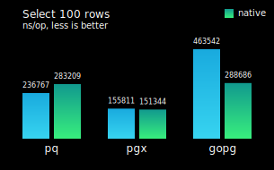

## ⚠️⚠️⚠️ RENAMED AND MOVED TO: [github.com/gopsql/psql](https://github.com/gopsql/psql)

# furk

*furk* is a simple tool, especially for developing RESTful API with JSON, to make PostgreSQL database queries. Some features are learned from Rails.

[](https://pkg.go.dev/github.com/caiguanhao/furk#section-directories)
[](https://travis-ci.com/caiguanhao/furk)

**Features:**

- ✅ Model is a database table and it is created from struct. Column names are inferred from struct field names. You can write less SQL statements for CRUD operations.
- ✅ Support JSONB data type, you can store many fields in one jsonb column, like Rails' [store_accessor](https://api.rubyonrails.org/v6.1.3/classes/ActiveRecord/Store.html).
- ✅ Safely insert and update record with Filter() to filter unwanted data, like Rails' [permit](https://api.rubyonrails.org/v6.1.2.1/classes/ActionController/Parameters.html).
- ✅ Migrate your database like Rails database migrations.
- ✅ Support pq, pgx and go-pg, you can switch driver at runtime.

## Model

For more use cases, see [Examples](db/examples_test.go) or [Tests](db/model_sql_test.go).

### Database Connection

You can choose one of three PostgreSQL drivers (pq, pgx, gopq) to use at runtime:
1. [github.com/lib/pq](https://github.com/lib/pq) v1.9.0
2. [github.com/jackc/pgx](https://github.com/jackc/pgx) v4.10.1
3. [github.com/go-pg/pg](https://github.com/go-pg/pg) v10.9.0

```go
// import "github.com/caiguanhao/furk/db"
// import "github.com/caiguanhao/furk/db/gopg"
// import "github.com/caiguanhao/furk/db/pgx"
// import "github.com/caiguanhao/furk/db/pq"

connStr := "postgres://localhost:5432/furktests?sslmode=disable"
connDrv := "gopg"
var conn db.DB
if connDrv == "pgx" {
	conn = pgx.MustOpen(connStr)
} else if connDrv == "gopg" {
	conn = gopg.MustOpen(connStr)
} else {
	conn = pq.MustOpen(connStr)
}
defer conn.Close()
var name string
conn.QueryRow("SELECT current_database()").Scan(&name)
fmt.Println(name) // furktests
```

Use pq only:

```go
// import "database/sql"
// import "github.com/caiguanhao/furk/db/standard"
// import _ "github.com/lib/pq"
c, err := sql.Open("postgres", "postgres://localhost:5432/furktests?sslmode=disable")
if err != nil {
	panic(err)
}
var conn db.DB = &standard.DB{c}
defer conn.Close()
if err := c.Ping(); err != nil {
	panic(err)
}
```

### Performance

For more information, see [Benchmark](db/benchmark_test.go).



For reference only. [db/gopg](db/gopg/gopg.go) is slower because go-pg's
Query() is very different from pq's or pgx's.

### New Model

```go
// type (
// 	Post struct {
// 		Id      int
// 		Title   string
// 		Picture string `jsonb:"meta"`
// 	}
// )
m := db.NewModel(Post{}, conn, logger.StandardLogger)
```

### Create Table

```go
// CREATE TABLE users (
//         id SERIAL PRIMARY KEY,
//         status text DEFAULT ''::text NOT NULL,
//         meta jsonb
// )
m.NewSQLWithValues(m.Schema()).MustExecute()
```

### Insert Record

```go
var newPostId int
m.Insert(
	m.Permit("Title", "Picture").Filter(`{ "Title": "hello", "Picture": "world!" }`),
)("RETURNING id").MustQueryRow(&newPostId)
```

### Find Record

```go
var firstPost Post
m.Find("WHERE id = $1", newPostId).MustQuery(&firstPost)

var ids []int
m.Select("id", "ORDER BY id ASC").MustQuery(&ids)

var id2title map[int]string
m.Select("id, title").MustQuery(&id2title)

var posts []Post
m.Find().MustQuery(&posts)
```

### Update Record

```go
var rowsAffected int
m.Update(
	m.Permit("Picture").Filter(`{ "Picture": "WORLD!" }`),
)("WHERE id = $1", newPostId).MustExecute(&rowsAffected)
```

### Delete Record

```go
var rowsDeleted int
m.Delete("WHERE id = $1", newPostId).MustExecute(&rowsDeleted)
```

### Other

```go
m.MustExists("WHERE id = $1", newPostId) // true or false
m.MustCount() // integer
```
